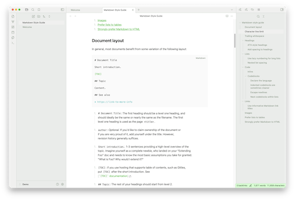
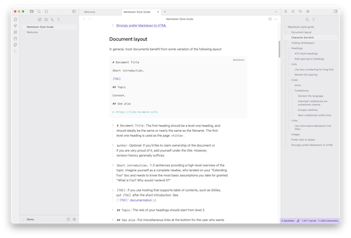

# Dynamic Color

> Disclaimer: Not an official Google project.

[Material Design](https://material.io) inspired theme that creates [dynamic color](https://codepen.io/Rody-Davis/pen/LYojpXB?editors=1111) palettes based on the current user selected [accent color](https://docs.obsidian.md/Reference/CSS+variables/Foundations/Colors#Accent+color). Supports light and dark mode.

## Install

Simply search `Dynamic Color` in the Obsidian Community Themes and Install.

Or if manually, copy the `theme.css` file to your vault directory and reload Obsidian for it to take effect.

## Screenshots

